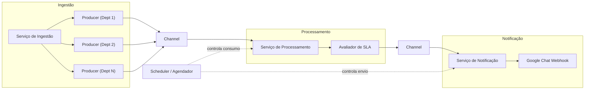

# Assyst Alerta

**Assyst Alerta** é um serviço de background .NET que monitora chamados de TI no IFS Assyst, detecta eventos de risco e violação de SLA, e notifica equipes de operações via webhooks em espaços do Google Chat.


---

## Arquitetura

### Pipeline assíncrono

Três estágios desacoplados por `System.Threading.Channels`. O `Scheduler` bloqueia todo o processamento fora do horário comercial configurado.



## Pré-requisitos

- [.NET 10 SDK](https://dotnet.microsoft.com/download/dotnet/10.0)
- Acesso ao IFS Assyst REST API
- Webhook configurado no Google Chat

---

## Configuração

Todas as seções são validadas na inicialização.

### `Scheduler`

| Chave | Tipo | Obrigatório | Padrão | Descrição |
|---|---|---|---|---|
| `StartTime` | `TimeOnly` | ✓ | `07:10:00` | Início do horário de operação |
| `EndTime` | `TimeOnly` | ✓ | `17:48:00` | Fim do horário de operação |
| `Days` | `DayOfWeek[]` | — | `Seg–Sex` | Dias úteis ativos |
| `Holidays` | `DateOnly[]` | — | `[]` | Feriados sem processamento |

### `Ingestion`

| Chave | Tipo | Obrigatório | Padrão | Descrição |
|---|---|---|---|---|
| `BaseUrl` | `Uri` | ✓ | — | URL base da API do IFS Assyst |
| `Authorization` | `string` | ✓ | — | Header HTTP Basic (max 2048 chars) |
| `DepartmentIds` | `int[]` | ✓ | — | IDs dos departamentos monitorados (1–20) |
| `PollingInterval` | `TimeSpan` | — | `00:00:05` | Intervalo de polling (1s–1m) |
| `RequestTimeout` | `TimeSpan` | — | `00:00:15` | Timeout das requisições (1s–1m) |

### `Processing`

| Chave | Tipo | Obrigatório | Padrão | Descrição |
|---|---|---|---|---|
| `Sla` | `TimeSpan` | ✓ | — | Janela de SLA (máx 6h) |
| `NearBreachThreshold` | `double` | ✓ | `0.75` | Percentual para acionar NearBreach (0.0–0.9) |
| `AssignorDepartmentsFilter` | `string[]` | ✓ | — | Departamentos que disparam alertas (mín 1) |

### `Notification`

| Chave | Tipo | Obrigatório | Padrão | Descrição |
|---|---|---|---|---|
| `WebhookUrl` | `Uri` | ✓ | — | URL do webhook do Google Chat |
| `EventUrlFormat` | `Uri` | ✓ | — | URL do portal com `{0}` como placeholder do ID do chamado |

---

## Como executar

```bash
# Build
dotnet build src/assyst-alerta.slnx

# Executar em desenvolvimento
dotnet run --project src/Assyst.Alerta

# Publicar executável autônomo
dotnet publish src/Assyst.Alerta -c Release --self-contained
```

---

## Tecnologias

- [.NET 10](https://dotnet.microsoft.com/) — runtime e hosting
- [Serilog](https://serilog.net/) — logging estruturado
- [Polly](https://github.com/App-vNext/Polly) via `Microsoft.Extensions.Http.Resilience` — circuit breaker na ingestão
- `System.Threading.Channels` — desacoplamento assíncrono entre estágios
- [xUnit](https://xunit.net/) · [FluentAssertions](https://fluentassertions.com/) — testes unitários
